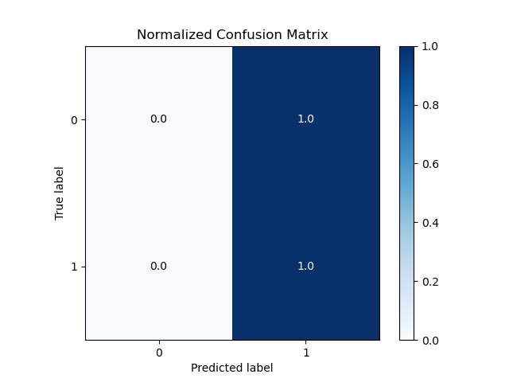
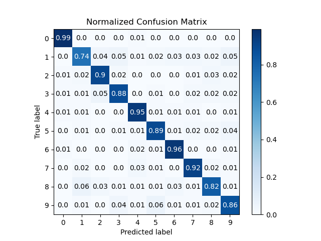
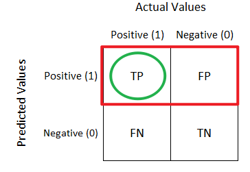
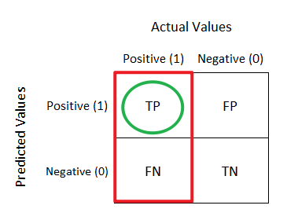
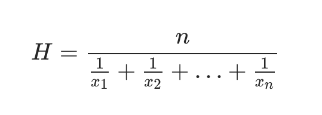

## 分类模型的评价指标
### 准确率
在面对不平衡样本（100个样本，1个为true，99个faluse）时，无法反映模型性能 
处理不平衡：
* 处理样本：重采样，欠采样，过采样
* 更换指标：F1-score

### 混淆矩阵
* 二元混淆矩阵：

* 多元混淆矩阵：

#### 混淆矩阵的衍生指标
* 精准率precision
模型预测为1,真正为1的占比（即预测为1的准确率）

* 召回率recall
真实是1的样本中，模型预测为1的占比 

如一共发生了10次地震，我们情愿发出1000次警报，这样能把这10次地震都涵盖进去（此时recall是100%，precision是1%），也不要发出100次警报，其中有8次地震给预测到了，但漏了2次（此时recall是80%，precision是8%）
* F1-score
  调和平均数： 
  使用调和平均数可以降低较大值或较小值的权重，防止一个极大值一个极小值的结果和两个中间值的结果相似。  
  F1-score是精准率和召回率的调和平均数，F1值背后的思想就是，precision和recall二者都平平的算法比一个指标巨好另一个指标巨差的算法靠谱
  
  