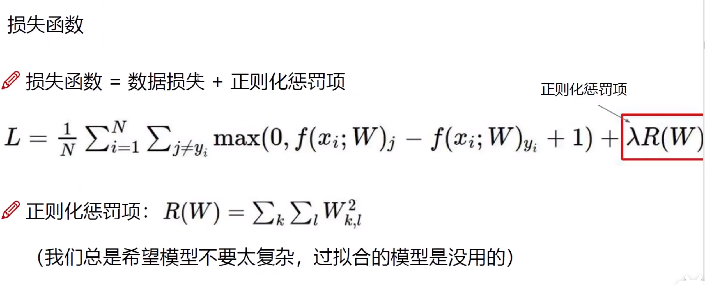
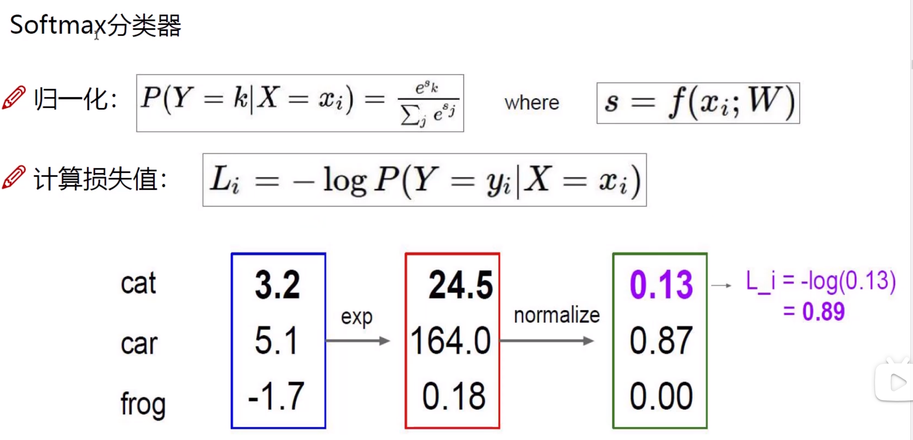
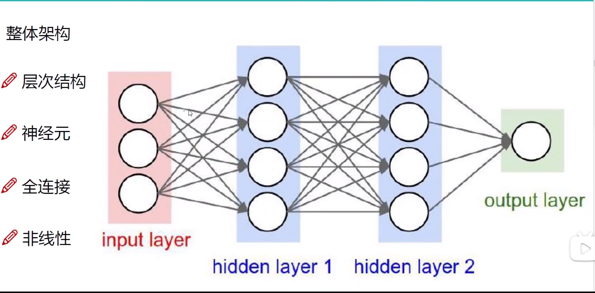

# 概览
* ai领域包括机器学习，机器学习包括深度学习
* 机器学习的基本步骤：数据获取，特征工程，模型构建，模型训练，结果评估
* 深度学习使用神经网络，相当于一个黒盒，可以自动进行特征工程，模型构造等工作，可以大量应用于图形工作和自然语言处理。计算量，参数量很大。
## 前向传播
* 在图像分类问题中，每一种类别对应一组权重值w和偏移量b，通过与像素矩阵乘法获取该图片对该分类的得分矩阵（在神经网络中常常使用多层的权重变换），矩阵元素求和得到该类别的得分
* 损失函数L用于计算此次预测的结果相对于真实值的差距  
  一个简单的损失函数示例：
  

  

  使用softmax分类器，可以获取该得分属于该分类的概率值,可以用于损失函数的构建。
  

  ## 反向传播
  * 梯度下降
  * 整体架构 
  
  在输入层和隐藏层之间，输入与各层的权重参数进行矩阵乘法，得到结果再进行非线性变换（激活函数），然后进入下一层重复步骤。
    * 激活函数  
       * sigmoid：当输入过小或者过大时存在梯消失现象  
       * Relu：常用